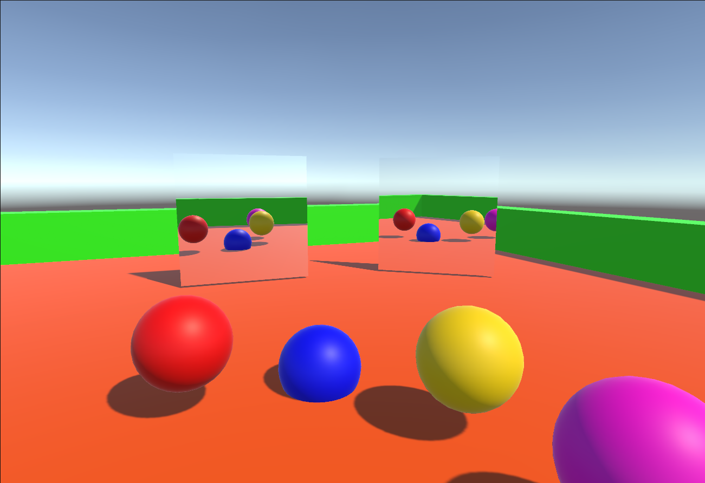

# Mirror Rendering

This project demonstrates a mirror rendering system using an off-axis projection approach in Unity. It leverages a custom projection plane and camera to render the scene as seen through a mirror. The rendered output is mapped onto a surface to simulate a real-time mirror effect.

## Screenshots

